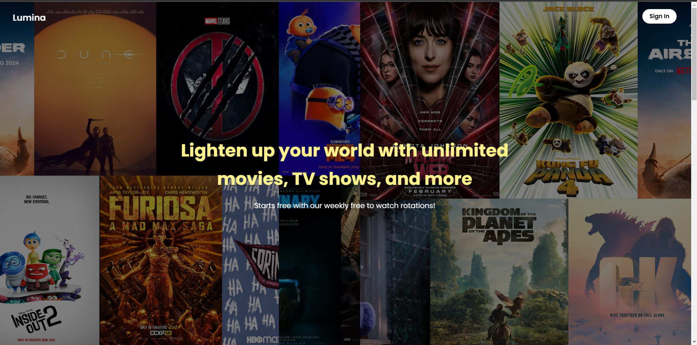
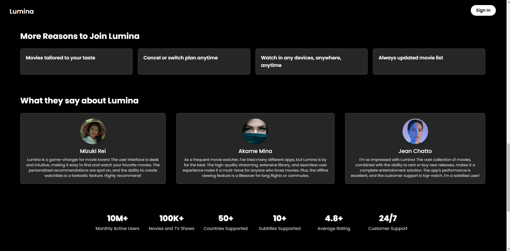
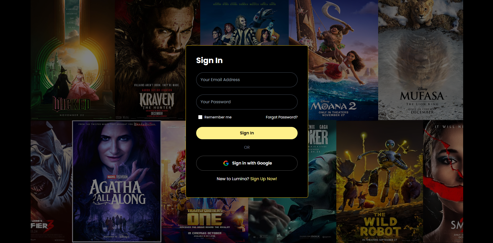
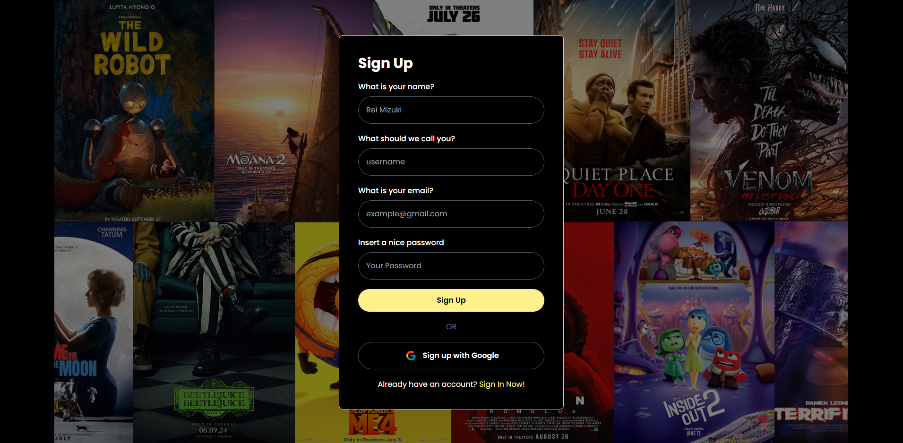
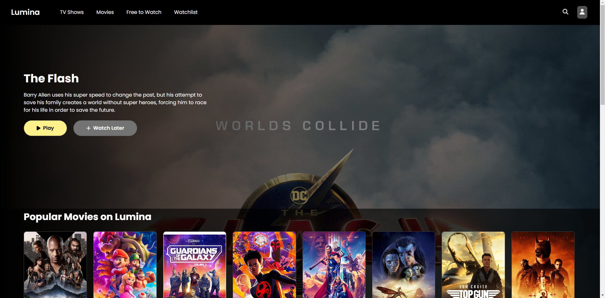
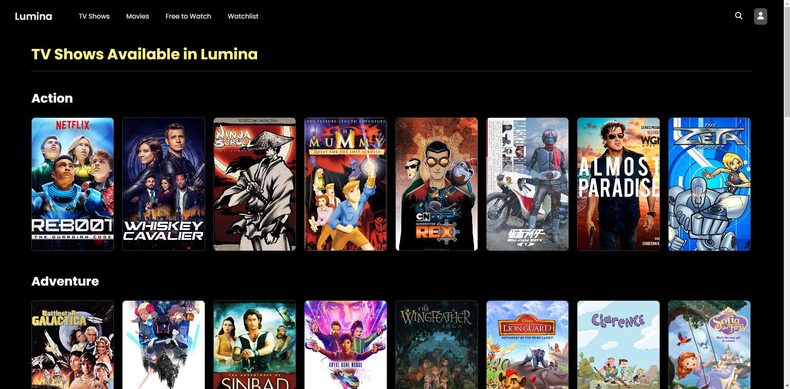
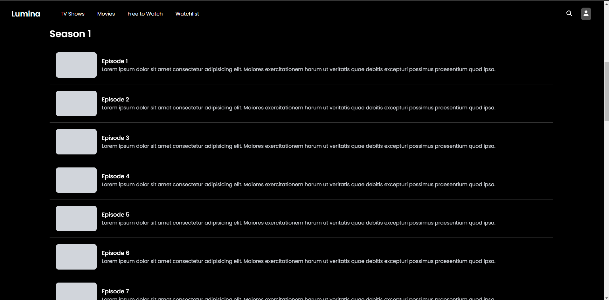
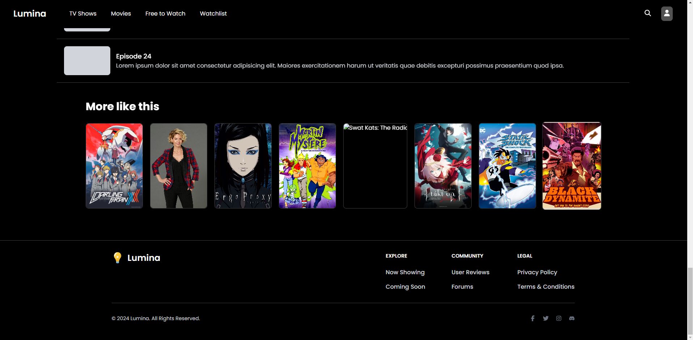

# Lumina 🎥  
**Lumina** is a movie streaming website inspired by Netflix. It provides users access to movies, TV shows, personalized watchlists, and more. Built with **ReactJS** for the frontend, **Django** for the backend, **Redis** for caching, and **PostgreSQL** for the database, Lumina integrates with a public movies API via RapidAPI.

## Table of Contents  
- [Features](#features)  
- [Tech Stack](#tech-stack)  
- [Getting Started](#getting-started)  
  - [Prerequisites](#prerequisites)  
  - [Installation](#installation)  
  - [Running the Application](#running-the-application)  
- [API Integration](#api-integration)  
- [Pages](#pages)  
- [Screenshots](#screenshots)   

---

## Features

- **Secure Authentication:** User sign-up, sign-in, and session management.
- **Personalized Watchlist:** Save movies and TV shows to watch later.
- **Search Functionality:** Search for movies and TV shows by title.
- **Free-to-Watch Content:** Access free content easily.
- **Detail Pages:** View in-depth information for specific movies or TV shows.
- **Responsive Design:** Optimized for both desktop and mobile.

---

## Tech Stack

### Frontend:

- **ReactJS**
- **React Router**
- **CSS (for styling)**

### Backend:

- **Django**
- **Django REST Framework**
- **Redis** for caching
- **PostgreSQL** for data storage

### API:

- Public movies API from **RapidAPI**  
  https://rapidapi.com/SAdrian/api/moviesdatabase

---

## Getting Started

### Prerequisites

- **Node.js** (v16 or later)
- **Python** (v3.10 or later)
- **PostgreSQL**
- **Redis**
- **npm** or **yarn**

### Installation

1. **Clone the repository**

   ```bash
   git clone https://github.com/yourusername/lumina.git
   cd lumina
   ```

2. **Frontend Setup**

   ```bash
   cd frontend
   npm install
   ```

3. **Backend Setup**

   ```bash
   cd backend
   pip install -r requirements.txt
   python manage.py migrate
   ```

4. **Environment Variables**  
   Create `.env` files for both frontend and backend with required variables:

   - **Backend (`backend/.env`)**
     ```env
     RAPIDAPI_KEY=your_rapidapi_key
     ```

5. **Start Redis Server**

   ```bash
   redis-server
   ```

6. **Run Frontend and Backend**
   - Frontend:
     ```bash
     cd frontend
     npm start
     ```
   - Backend:
     ```bash
     cd backend
     python manage.py runserver
     ```

---

## API Integration

This project uses a public movies API from **RapidAPI** to fetch movie and TV show data. Ensure you have your RapidAPI key set in your `.env` file.

---

## Pages

### Public Pages

- **Landing:** Welcome page for unauthenticated users.
- **Sign In:** Login page.
- **Sign Up:** Registration page.

### Protected Pages

- **Home:** Dashboard with personalized content.
- **TV Shows:** Browse TV shows.
- **Movies:** Browse movies.
- **Movie/TV Show Detail:** Specific content details.
- **Watchlist:** View saved items.
- **Free to Watch:** Browse free content.
- **Search:** Search for movies/TV shows by title.

---

## Screenshots

Add screenshots of your application here to showcase its features. For example:

### Landing Page

  
  


### Sign In Page



### Sign Up Page



### Home Page



### TV Shows Page



### Free to Watch Page


### Detail Page

  
  


---
